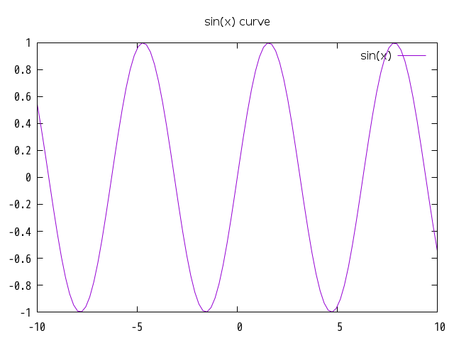
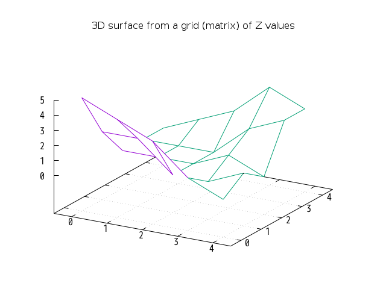

NAME
====

Chart::Gnuplot - A Perl 6 bindings for gnuplot

SYNOPSIS
========

### SOURCE

    use Chart::Gnuplot;

    my $gnu = Chart::Gnuplot.new(:terminal("png"), :filename("synopsis.png"));
    $gnu.title(:text("sin(x) curve"));
    $gnu.plot(:function('sin(x)'));

### OUTPUT

DESCRIPTION
===========

Chart::Gnuplot is a Perl 6 bindings for gnuplot. Chart::Gnuplot runs `gnuplot` using `Proc::Async` and enables you to plot chart or graph with Perl6ish interface.

METHODS
-------

### terminal

Defined as:

    method terminal($terminal)

Tells gnuplot what kind of output to generate.

### plot

### splot

### label

### xlabel

### ylabel

### zlabel

### x2label

### y2label

### cblabel

### xrange

### yrange

### zrange

### x2range

### y2range

### cbrange

### rrange

### trange

### urange

### vrange

### xtics

### ytics

### ztics

### x2tics

### y2tics

### cbtics

### legend

### border

### grid

### timestamp

### rectangle

### ellipse

### circle

### polygon

### title

### arrow

### multiplot

### command

EXAMPLES
========

3D surface from a grid (matrix) of Z values
-------------------------------------------

### SOURCE

    use Chart::Gnuplot;

    my $gnu = Chart::Gnuplot.new(:terminal("png"), :filename("surface.dem.00.png"));
    $gnu.title(:text("3D surface from a grid (matrix) of Z values"));
    $gnu.xrange(:min(-0.5), :max(4.5));
    $gnu.yrange(:min(-0.5), :max(4.5));
    $gnu.grid;
    $gnu.command("set hidden3d");

    my @grid = (q:to/EOF/).split("\n", :skip-empty)>>.split(" ", :skip-empty);
    5 4 3 1 0
    2 2 0 0 1
    0 0 0 1 0
    0 0 0 2 3
    0 1 2 4 3
    EOF

    $gnu.splot(:vertices(@grid), :style("lines"), :title(False), :matrix);

### OUTPUT

AUTHOR
======

titsuki <titsuki@cpan.org>

COPYRIGHT AND LICENSE
=====================

Copyright 2017 titsuki

This library is free software; you can redistribute it and/or modify it under the GNU General Public License version 3.0.
