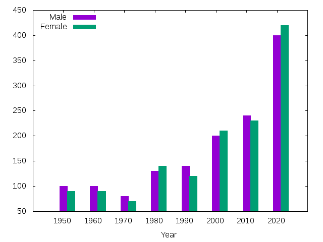

NAME
====

Chart::Gnuplot - A Raku bindings for gnuplot

SYNOPSIS
========

### SOURCE

    use Chart::Gnuplot;
    use Chart::Gnuplot::Subset;
    my $gnu = Chart::Gnuplot.new(:terminal("png"), :filename("histogram.png"));

    my @data = (q:to/EOF/).split("\n", :skip-empty)>>.split(" ", :skip-empty);
    Year Male Female
    1950 100 90
    1960 100 90
    1970 80 70
    1980 130 140
    1990 140 120
    2000 200 210
    2010 240 230
    2020 400 420
    EOF

    my ($header, *@body) = @data;

    $gnu.command("set style histogram clustered");
    $gnu.legend(:left);
    my AnyTicsTic @tics = (@body>>.[0]).pairs.map(-> (:key($pos), :value($year)) { %(:label($year), :pos($pos)) });
    $gnu.xtics(:tics(@tics));
    $gnu.xlabel(:label($header[0]));
    $gnu.plot(:vertices(@body), :using([2]), :style("histogram"), :title($header[1]), :fill("solid 1.0"));
    $gnu.plot(:vertices(@body), :using([3]), :style("histogram"), :title($header[2]), :fill("solid 1.0"));

    $gnu.dispose;

### OUTPUT

DESCRIPTION
===========

Chart::Gnuplot is a Raku naive bindings for gnuplot. Chart::Gnuplot runs `gnuplot` using `Proc::Async` and enables you to plot chart or graph with Rakuish interface.

SUBSET
------

Defined as:

    subset FalseOnly of Bool is export where { $_ ~~ Bool:U or $_ === False };
    subset TrueOnly of Bool is export where { $_ ~~ Bool:U or $_ === True};
    subset LabelRotate of Cool is export where { $_ ~~ Cool:U or $_ ~~ Real or $_ === False };
    subset AnyLabelRotate of Cool is export where { $_ ~~ Cool:U or $_ eq "parallel" or $_ ~~ Real or $_ === False };
    subset LegendMax of Cool is export where { $_ ~~ Cool:U or $_ eq "auto" or $_ ~~ Real };
    subset AnyTicsRotate of Cool is export where { $_ ~~ Cool:U or $_ ~~ Real or $_ === False };
    subset AnyTicsOffset of Mu is export where { $_ ~~ Mu:U or $_ ~~ FalseOnly or ($_ ~~ List and $_.all ~~ Pair|Real) };
    subset AnyTicsTic of Mu is export where { $_ ~~ Mu:U or $_ ~~ Hash and .<label>:exists and .<pos>:exists and .keys.grep(* eq "label"|"pos"|"level").elems == .keys.elems };

METHODS
-------

### terminal

Defined as:

    method terminal($terminal)

Tells gnuplot what kind of output to generate.

### plot

Defined as:

    multi method plot(
            :$title, :$ignore, :@range, :@vertices!, :$smooth,
            :@using,
            Str :$style, :ls(:$linestyle), :lt(:$linetype), :lw(:$linewidth), :lc(:$linecolor),
            :pt(:$pointtype), :ps(:$pointsize), :$fill, FalseOnly :$hidden3d, FalseOnly :$contours,
            FalseOnly :$surface, :$palette,
            :&writer? = -> $msg { self.command: $msg }
    )

    multi method plot(
          :$title, :$ignore, :@range, :$function!, :$smooth,
          Str :$style, :ls(:$linestyle), :lt(:$linetype), :lw(:$linewidth), :lc(:$linecolor),
          :pt(:$pointtype), :ps(:$pointsize), :$fill, FalseOnly :$hidden3d, FalseOnly :$contours,
          FalseOnly :$surface, :$palette,
          :&writer? = -> $msg { self.command: $msg }
    )

Draws a 2-dimensional plot.

### splot

Defined as:

    multi method splot(
          :@range,
          :@vertices!, :$smooth,
          :$binary, :$matrix, :$index, :$every,
          :$title, :$style, :ls(:$linestyle), :lt(:$linetype), :lw(:$linewidth), :lc(:$linecolor),
          :$pointtype, :$pointsize, :$fill, FalseOnly :$hidden3d, FalseOnly :$contours,
          FalseOnly :$surface, :$palette, :&writer? = -> $msg { self.command: $msg }
    )

    multi method splot(
          :@range,
          :$function!, :$smooth,
          :$title, :$style, :ls(:$linestyle), :lt(:$linetype), :lw(:$linewidth), :lc(:$linecolor),
          :$pointtype, :$pointsize, :$fill, FalseOnly :$hidden3d, FalseOnly :$contours,
          FalseOnly :$surface, :$palette, :&writer? = -> $msg { self.command: $msg }
    )

Draws a 3-dimensional plot.

### label

Defined as:

    method label(
           :$tag, Str :$label-text, :$at, TrueOnly :$left, TrueOnly :$center, TrueOnly :$right,
           LabelRotate :$rotate, :$font-name, :$font-size, FalseOnly :$enhanced,
           TrueOnly :$front, TrueOnly :$back, :$textcolor, FalseOnly :$point, :$line-type, :$point-type, :$point-size, :$offset,
           TrueOnly :$boxed, TrueOnly :$hypertext, :&writer? = -> $msg { self.command: $msg }
    )

Places the text string at the corresponding 2D or 3D position.

### xlabel

Defined as:

    method xlabel(
           Str :$label, :$offset, :$font-name, :$font-size, :$textcolor,
           Bool :$enhanced, AnyLabelRotate :$rotate, :&writer? = -> $msg { self.command: $msg }
    )

Sets the x-axis label.

### ylabel

Defined as:

    method ylabel(
           Str :$label, :$offset, :$font-name, :$font-size, :$textcolor,
           Bool :$enhanced, AnyLabelRotate :$rotate, :&writer? = -> $msg { self.command: $msg }
    )

Sets the y-axis label.

### zlabel

Defined as:

    method zlabel(
           Str :$label, :$offset, :$font-name, :$font-size, :$textcolor,
           Bool :$enhanced, AnyLabelRotate :$rotate, :&writer? = -> $msg { self.command: $msg }
    )

Sets the z-axis label.

### x2label

Defined as:

    method x2label(
           Str :$label, :$offset, :$font-name, :$font-size, :$textcolor,
           Bool :$enhanced, AnyLabelRotate :$rotate, :&writer? = -> $msg { self.command: $msg }
    )

Sets the x2-axis label.

### y2label

Defined as:

    method y2label(
           Str :$label, :$offset, :$font-name, :$font-size, :$textcolor,
           Bool :$enhanced, AnyLabelRotate :$rotate, :&writer? = -> $msg { self.command: $msg }
    )

Sets the y2-axis label.

### cblabel

Defined as:

    method cblabel(
           Str :$label, :$offset, :$font-name, :$font-size, :$textcolor,
           Bool :$enhanced, AnyLabelRotate :$rotate, :&writer? = -> $msg { self.command: $msg }
    )

Sets the cb-axis label.

### xrange

Defined as:

    multi method xrange(
          :$min, :$max, Bool :$reverse, Bool :$writeback, Bool :$extend,
          :&writer? = -> $msg { self.command: $msg }
    )

    multi method xrange(TrueOnly :$restore, :&writer? = -> $msg { self.command: $msg })

Sets the horizontal range that will be displayed.

### yrange

Defined as:

    multi method yrange(
          :$min, :$max, Bool :$reverse, Bool :$writeback, Bool :$extend,
          :&writer? = -> $msg { self.command: $msg }
    )

    multi method yrange(TrueOnly :$restore, :&writer? = -> $msg { self.command: $msg })

Sets the vertical range that will be displayed.

### zrange

Defined as:

    multi method zrange(
          :$min, :$max, Bool :$reverse, Bool :$writeback, Bool :$extend,
          :&writer? = -> $msg { self.command: $msg }
    )

    multi method zrange(TrueOnly :$restore, :&writer? = -> $msg { self.command: $msg })

Sets the range that will be displayed on the z axis.

### x2range

Defined as:

    multi method x2range(
          :$min, :$max, Bool :$reverse, Bool :$writeback, Bool :$extend,
          :&writer? = -> $msg { self.command: $msg }
    )

    multi method x2range(TrueOnly :$restore, :&writer? = -> $msg { self.command: $msg })

Sets the range that will be displayed on the x2 axis.

### y2range

Defined as:

    multi method y2range(
          :$min, :$max, Bool :$reverse, Bool :$writeback, Bool :$extend,
          :&writer? = -> $msg { self.command: $msg }
    )

    multi method y2range(TrueOnly :$restore, :&writer? = -> $msg { self.command: $msg })

Sets the range that will be displayed on the y2 axis.

### cbrange

Defined as:

    multi method cbrange(
          :$min, :$max, Bool :$reverse, Bool :$writeback, Bool :$extend,
          :&writer? = -> $msg { self.command: $msg }
    )

    multi method cbrange(TrueOnly :$restore, :&writer? = -> $msg { self.command: $msg })

Sets the range of values which are colored.

### rrange

Defined as:

    multi method rrange(
          :$min, :$max, Bool :$reverse, Bool :$writeback, Bool :$extend,
          :&writer? = -> $msg { self.command: $msg }
    )

    multi method rrange(TrueOnly :$restore, :&writer? = -> $msg { self.command: $msg })

Sets the range that will be displayed on the r axis.

### trange

Defined as:

    multi method trange(
          :$min, :$max, Bool :$reverse, Bool :$writeback, Bool :$extend,
          :&writer? = -> $msg { self.command: $msg }
    )

    multi method trange(TrueOnly :$restore, :&writer? = -> $msg { self.command: $msg })

Sets the parametric range used to compute x and y values when in parametric or polar modes.

### urange

Defined as:

    multi method urange(
          :$min, :$max, Bool :$reverse, Bool :$writeback, Bool :$extend,
          :&writer? = -> $msg { self.command: $msg }
    )

    multi method urange(TrueOnly :$restore, :&writer? = -> $msg { self.command: $msg })

Set the parametric ranges used to compute x, y, and z values when in splot parametric mode.

### vrange

Defined as:

    multi method vrange(
          :$min, :$max, Bool :$reverse, Bool :$writeback, Bool :$extend,
          :&writer? = -> $msg { self.command: $msg }
    )

    multi method vrange(TrueOnly :$restore, :&writer? = -> $msg { self.command: $msg })

Set the parametric ranges used to compute x, y, and z values when in splot parametric mode.

### xtics

Defined as:

    method xtics(
           TrueOnly :$axis, TrueOnly :$border, Bool :$mirror,
           TrueOnly :$in, TrueOnly :$out, TrueOnly :$scale-default, :$scale-major, :$scale-minor, AnyTicsRotate :$rotate, AnyTicsOffset :$offset,
           TrueOnly :$left, TrueOnly :$right, TrueOnly :$center, TrueOnly :$autojustify,
           TrueOnly :$add,
           TrueOnly :$autofreq,
           :$incr,
           :$start, :$end,
           :@tics where Array[AnyTicsTic] | Array[],
           :$format, :$font-name, :$font-size, Bool :$enhanced,
           TrueOnly :$numeric, TrueOnly :$timedate, TrueOnly :$geographic,
           TrueOnly :$rangelimited,
           :$textcolor, :&writer? = -> $msg { self.command: $msg }
    )

Controls the major (labeled) tics on the x axis.

### ytics

Defined as:

    method ytics(
           TrueOnly :$axis, TrueOnly :$border, Bool :$mirror,
           TrueOnly :$in, TrueOnly :$out, TrueOnly :$scale-default, :$scale-major, :$scale-minor, AnyTicsRotate :$rotate, AnyTicsOffset :$offset,
           TrueOnly :$left, TrueOnly :$right, TrueOnly :$center, TrueOnly :$autojustify,
           TrueOnly :$add,
           TrueOnly :$autofreq,
           :$incr,
           :$start, :$end,
           :@tics where Array[AnyTicsTic] | Array[],
           :$format, :$font-name, :$font-size, Bool :$enhanced,
           TrueOnly :$numeric, TrueOnly :$timedate, TrueOnly :$geographic,
           TrueOnly :$rangelimited,
           :$textcolor, :&writer? = -> $msg { self.command: $msg }
    )

Controls the major (labeled) tics on the y axis.

### ztics

Defined as:

    method ztics(
           TrueOnly :$axis, TrueOnly :$border, Bool :$mirror,
           TrueOnly :$in, TrueOnly :$out, TrueOnly :$scale-default, :$scale-major, :$scale-minor, AnyTicsRotate :$rotate, AnyTicsOffset :$offset,
           TrueOnly :$left, TrueOnly :$right, TrueOnly :$center, TrueOnly :$autojustify,
           TrueOnly :$add,
           TrueOnly :$autofreq,
           :$incr,
           :$start, :$end,
           :@tics where Array[AnyTicsTic] | Array[],
           :$format, :$font-name, :$font-size, Bool :$enhanced,
           TrueOnly :$numeric, TrueOnly :$timedate, TrueOnly :$geographic,
           TrueOnly :$rangelimited,
           :$textcolor, :&writer? = -> $msg { self.command: $msg }
    )

Controls the major (labeled) tics on the z axis.

### x2tics

Defined as:

    method x2tics(
           TrueOnly :$axis, TrueOnly :$border, Bool :$mirror,
           TrueOnly :$in, TrueOnly :$out, TrueOnly :$scale-default, :$scale-major, :$scale-minor, AnyTicsRotate :$rotate, AnyTicsOffset :$offset,
           TrueOnly :$left, TrueOnly :$right, TrueOnly :$center, TrueOnly :$autojustify,
           TrueOnly :$add,
           TrueOnly :$autofreq,
           :$incr,
           :$start, :$end,
           :@tics where Array[AnyTicsTic] | Array[],
           :$format, :$font-name, :$font-size, Bool :$enhanced,
           TrueOnly :$numeric, TrueOnly :$timedate, TrueOnly :$geographic,
           TrueOnly :$rangelimited,
           :$textcolor, :&writer? = -> $msg { self.command: $msg }
    )

Controls the major (labeled) tics on the x2 axis.

### y2tics

Defined as:

    method y2tics(
           TrueOnly :$axis, TrueOnly :$border, Bool :$mirror,
           TrueOnly :$in, TrueOnly :$out, TrueOnly :$scale-default, :$scale-major, :$scale-minor, AnyTicsRotate :$rotate, AnyTicsOffset :$offset,
           TrueOnly :$left, TrueOnly :$right, TrueOnly :$center, TrueOnly :$autojustify,
           TrueOnly :$add,
           TrueOnly :$autofreq,
           :$incr,
           :$start, :$end,
           :@tics where Array[AnyTicsTic] | Array[],
           :$format, :$font-name, :$font-size, Bool :$enhanced,
           TrueOnly :$numeric, TrueOnly :$timedate, TrueOnly :$geographic,
           TrueOnly :$rangelimited,
           :$textcolor, :&writer? = -> $msg { self.command: $msg }
    )

Controls the major (labeled) tics on the y2 axis.

### cbtics

Defined as:

    method cbtics(
           TrueOnly :$axis, TrueOnly :$border, Bool :$mirror,
           TrueOnly :$in, TrueOnly :$out, TrueOnly :$scale-default, :$scale-major, :$scale-minor, AnyTicsRotate :$rotate, AnyTicsOffset :$offset,
           TrueOnly :$left, TrueOnly :$right, TrueOnly :$center, TrueOnly :$autojustify,
           TrueOnly :$add,
           TrueOnly :$autofreq,
           :$incr,
           :$start, :$end,
           :@tics where Array[AnyTicsTic] | Array[],
           :$format, :$font-name, :$font-size, Bool :$enhanced,
           TrueOnly :$numeric, TrueOnly :$timedate, TrueOnly :$geographic,
           TrueOnly :$rangelimited,
           :$textcolor, :&writer? = -> $msg { self.command: $msg }
    )

Controls the major (labeled) tics on the color box axis.

### legend

Defined as:

    method legend(
           TrueOnly :$on, TrueOnly :$off, TrueOnly :$default, TrueOnly :$inside, TrueOnly :$outside, TrueOnly :$lmargin, TrueOnly :$rmargin, TrueOnly :$tmargin, TrueOnly :$bmargin,
           :$at,
           TrueOnly :$left, TrueOnly :$right, TrueOnly :$center, TrueOnly :$top, TrueOnly :$bottom,
           TrueOnly :$vertical, TrueOnly :$horizontal, TrueOnly :$Left, TrueOnly :$Right,
           Bool :$opaque, Bool :$reverse, Bool :$invert,
           :$samplen, :$spacing, :$width, :$height,
           TrueOnly :$autotitle, TrueOnly :$columnheader, :$title, :$font-name, :$font-size, :$textcolor,
           Bool :$box, :$linestyle, :$linetype, :$linewidth,
           LegendMax :$maxcols, LegendMax :$maxrows, :&writer? = -> $msg { self.command: $msg }
    )

Enables a key (or legend) containing a title and a sample (line, point, box) for each plot in the graph.

### border

Defined as:

    method border(
           :$integer, TrueOnly :$front, TrueOnly :$back, TrueOnly :$behind,
           :lw(:$linewidth), :ls(:$linestyle), :lt(:$linetype), :&writer? = -> $msg { self.command: $msg }
    )

Controls the display of the graph borders for the plot and splot commands.

### grid

Defined as:

    method grid(
           Bool :$xtics, TrueOnly :$mxtics, Bool :$ytics, TrueOnly :$mytics, Bool :$ztics, TrueOnly :$mztics,
           Bool :$x2tics, TrueOnly :$mx2tics, Bool :$y2tics, TrueOnly :$my2tics, Bool :$cbtics, TrueOnly :$mcbtics,
           :$polar, TrueOnly :$layerdefault, TrueOnly :$front, TrueOnly :$back,
           :ls(:@linestyle), :lt(:@linetype), :lw(:@linewidth), :&writer? = -> $msg { self.command: $msg }
    )

Allows grid lines to be drawn on the plot.

### timestamp

Defined as:

    method timestamp(
            Str :$format, TrueOnly :$top, TrueOnly :$bottom, Bool :$rotate,
            :$offset, :$font-name, :$font-size, :$textcolor, :&writer? = -> $msg { self.command: $msg }
    )

Places the time and date of the plot in the left margin.

### rectangle

Defined as:

    multi method rectangle(
          :$index!, :$from, :$to,
          TrueOnly :$front, TrueOnly :$back, TrueOnly :$behind, Bool :$clip, :$fillcolor, :$fillstyle,
          TrueOnly :$default, :$linewidth, :$dashtype, :&writer? = -> $msg { self.command: $msg }
    )

    multi method rectangle(
          :$index, :$from, :$rto,
          TrueOnly :$front, TrueOnly :$back, TrueOnly :$behind, Bool :$clip, :$fillcolor, :$fillstyle,
          TrueOnly :$default, :$linewidth, :$dashtype, :&writer? = -> $msg { self.command: $msg }
    )

Defines a single rectangle which will appear in all subsequent 2D plot.

### ellipse

Defined as:

    method ellipse(
           :$index, :center(:$at), :$w!, :$h!,
           TrueOnly :$front, TrueOnly :$back, TrueOnly :$behind, Bool :$clip, :$fillcolor, :$fillstyle,
           TrueOnly :$default, :$linewidth, :$dashtype, :&writer? = -> $msg { self.command: $msg }
    )

Defines a single ellipse which will appear in all subsequent 2D plot.

### circle

Defined as:

    method circle(
           :$index, :center(:$at), :$radius!,
           TrueOnly :$front, TrueOnly :$back, TrueOnly :$behind, Bool :$clip, :$fillcolor, :$fillstyle,
           TrueOnly :$default, :$linewidth, :$dashtype, :&writer? = -> $msg { self.command: $msg }
    )

Defines a single circle which will appear in all subsequent 2D plot.

### polygon

Defined as:

    method polygon(
           :$index, :$from, :@to,
           TrueOnly :$front, TrueOnly :$back, TrueOnly :$behind, Bool :$clip, :$fillcolor, :$fillstyle,
           TrueOnly :$default, :$linewidth, :$dashtype, :&writer? = -> $msg { self.command: $msg }
    )

Defines a single polygon which will appear in all subsequent 2D plot.

### title

Defined as:

    method title(
           Str :$text, :$offset, :$font-name, :$font-size, :tc(:$textcolor), :$colorspec, Bool :$enhanced,
           :&writer? = -> $msg { self.command: $msg }
    )

Produces a plot title that is centered at the top of the plot.

### arrow

Defined as:

    multi method arrow(
          :$tag, :$from, :$to, Bool :$head, TrueOnly :$backhead, TrueOnly :$heads,
          :$head-length, :$head-angle, :$back-angle,
          Bool :$filled, TrueOnly :$empty, TrueOnly :$border,
          TrueOnly :$front, TrueOnly :$back,
          :ls(:$linestyle), :lt(:$linetype), :lw(:$linewidth), :lc(:$linecolor), :dt(:$dashtype), :&writer? = -> $msg { self.command: $msg }
    )

Places an arrow on a plot.

### multiplot

Defined as:

    multi method arrow(
          :$tag, :$from, :$rto, Bool :$head, TrueOnly :$backhead, TrueOnly :$heads,
          :$head-length, :$head-angle, :$back-angle,
          Bool :$filled, TrueOnly :$empty, TrueOnly :$border,
          TrueOnly :$front, TrueOnly :$back,
          :ls(:$linestyle), :lt(:$linetype), :lw(:$linewidth), :lc(:$linecolor), :dt(:$dashtype), :&writer? = -> $msg { self.command: $msg }
    )

Places gnuplot in the multiplot mode, in which several plots are placed next to each other on the same page or screen window.

### command

Defined as:

    method command(Str $command)

Runs a given `$command`. If there are no appropriate interfaces, this method will be a good alternative.

EXAMPLES
========

3D surface from a grid (matrix) of Z values
-------------------------------------------

### SOURCE

    use Chart::Gnuplot;

    my $gnu = Chart::Gnuplot.new(:terminal("png"), :filename("surface.dem.00.png"));
    $gnu.title(:text("3D surface from a grid (matrix) of Z values"));
    $gnu.xrange(:min(-0.5), :max(4.5));
    $gnu.yrange(:min(-0.5), :max(4.5));
    $gnu.grid;
    $gnu.command("set hidden3d");

    my @grid = (q:to/EOF/).split("\n", :skip-empty)>>.split(" ", :skip-empty);
    5 4 3 1 0
    2 2 0 0 1
    0 0 0 1 0
    0 0 0 2 3
    0 1 2 4 3
    EOF

    $gnu.splot(:vertices(@grid), :style("lines"), :title(False), :matrix);
    $gnu.dispose;

### OUTPUT

sin(x)
------

### SOURCE

    use Chart::Gnuplot;

    my $gnu = Chart::Gnuplot.new(:terminal("png"), :filename("sinx.png"));
    $gnu.title(:text("sin(x) curve"));
    $gnu.plot(:function('sin(x)'));
    $gnu.dispose;

### OUTPUT

Recall-Precision Curve
----------------------

### SOURCE

    use v6;
    use Chart::Gnuplot;

    my $gnu = Chart::Gnuplot.new(:terminal("png"), :filename("recprec.png"));
    $gnu.title(:text("Recall-Precision Curve"));
    $gnu.ylabel(:label("Precision"));
    $gnu.xlabel(:label("Recall"));
    $gnu.xrange(:min(0.0), :max(1.0));
    $gnu.yrange(:min(0.0), :max(1.0));

    my @methodA = (q:to/EOF/).split("\n", :skip-empty)>>.split(" ", :skip-empty);
    0.0 1.0
    0.1 0.95
    0.2 0.9
    0.3 0.85
    0.4 0.82
    0.5 0.6
    0.6 0.55
    0.7 0.51
    0.8 0.4
    0.9 0.38
    1.0 0.35
    EOF

    my @methodB = (q:to/EOF/).split("\n", :skip-empty)>>.split(" ", :skip-empty);
    0.0 1.0
    0.1 0.95
    0.2 0.8
    0.3 0.5
    0.4 0.4
    0.5 0.3
    0.6 0.2
    0.7 0.1
    0.8 0.08
    0.9 0.05
    1.0 0.05
    EOF

    my %methodA = %(:vertices(@methodA), :style("linespoints"), :title("proposed"), :lc(qw/rgb "green"/), :pt(10));
    my %methodB = %(:vertices(@methodB), :style("linespoints"), :title("baseline"), :lc(qw/rgb "red"/), :pt(13));

    $gnu.plot(|%methodA);
    $gnu.plot(|%methodB);
    $gnu.dispose;

### OUTPUT

AUTHOR
======

titsuki <titsuki@cpan.org>

COPYRIGHT AND LICENSE
=====================

Copyright 2017 titsuki

This library is free software; you can redistribute it and/or modify it under the GNU General Public License version 3.0.

